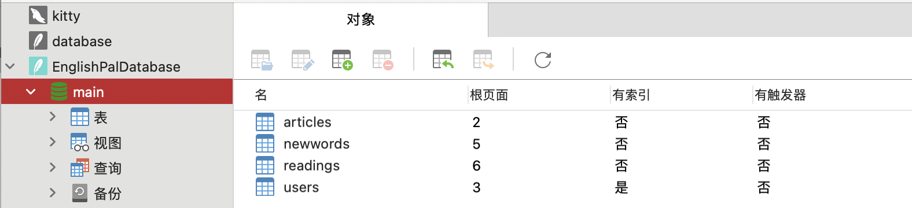
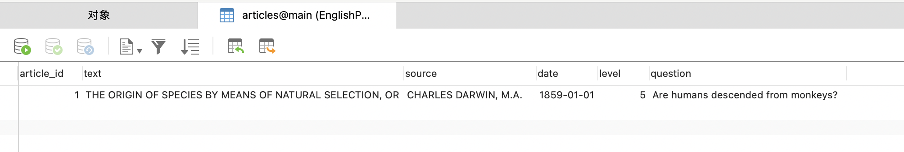
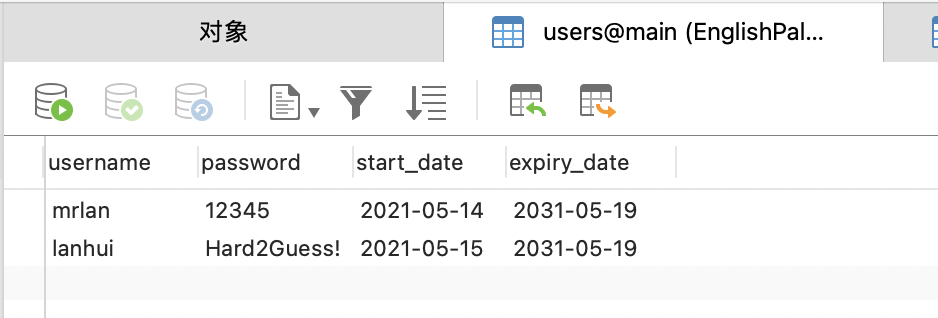
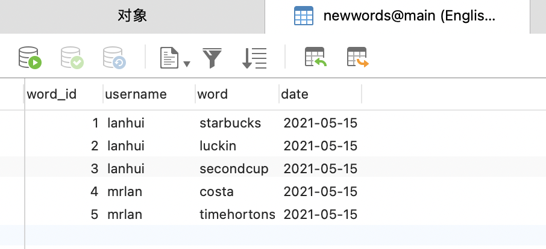
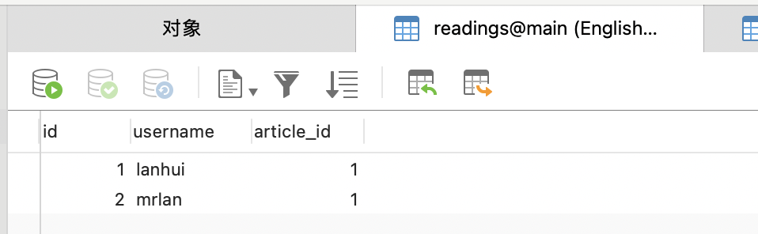

实验二: ORM的魔法
========================

.. raw:: html

   

作者：201836900206-李康恬、201836900203-陈佳瑛、

         201836900127-杨恺、201836000121-毛科捷

.. raw:: html

   

.. raw:: html

   

日期：2021/5/28  来源：浙江师范大学

.. raw:: html

   

摘要
------

在软件设计的过程中，软件工程师都不希望做一个“Bad Design”的设计。“Bad Design”让设计变得僵化、脆弱和难以复用。规避“Bad Design”，就是要减少模块间的相互依赖。OOD为我们提供了一种机制，叫做依赖倒置（Dependency Inversion）。

此次实验，我们通过使用SQLAlchemy的ORM（对象关系映射器）来操作数据库，学习并遵循依赖关系倒置的原则——让ORM依赖于域模型，而不是反过来让抽象依赖于具体。最终学会如何在无需编写任何一行原始SQL语句的情况下进行Web应用程序的设计开发。

实验的最后，我们在学习与多次尝试后成功地通过ORM来实现类与表的映射、数据库表的创建以及数据的插入。

介绍
------

很多软件工程师都多少在处理 “Bad Design” 时有一些痛苦的经历。如果发现这些“Bad Design”的始作俑者就是我们自己时，那感觉就更糟糕了。那么，到底是什么让我做出一个能称为“Bad Design” 的设计呢？

如果软件在满足客户需求的情况下，其呈现出了下述中的一个或多个特点，则就可称其为“Bad Design”：

1. 难以修改，因为每次修改都影响系统中的多个部分（僵化性Rigidity）；
2. 当修改时，难以预期系统中哪些地方会被影响（脆弱性Fragility）；
3. 难以在其他应用中重用，因为它不能从当前系统中解耦（复用性差Immobility）。

那到底是什么让设计变得僵化、脆弱和难以复用呢？

答案是模块间的相互依赖，这包含高层逻辑的模块依赖于低层模块的细节。

为了解决这个问题，OOD 为我们提供了一种机制，叫做依赖倒置（Dependency Inversion）。依赖倒置能够做到以下两点：

1. 高层模块不应该依赖于低层模块，二者都应该依赖于抽象；
2. 抽象不应该依赖于具体实现细节，而具体实现细节应该依赖于抽象。

在此次实验中，我们将使用SQLAlchemy的ORM（对象关系映射器）来操作数据库。

对象关系映射（英语：Object Relational Mapping，简称ORM，或O/RM，或O/R mapping），是一种程序设计技术，用于实现面向对象编程语言里不同类型系统的数据之间的转换。从效果上说，它其实是创建了一个可在编程语言里使用的“虚拟对象数据库”。对象关系映射成功运用在不同的面向对象持久层产品中，如：\ `Torque`_\ ，\ `OJB`_\ ，\ `Hibernate`_\ ，\ `TopLink`_\ ，Castor JDO，TJDO，\ `Active Record`_\ ，\ `NHibernate`_\ ，\ `ADO.NET Entity Framework`_\ 等。

与对象数据库相比，关系数据库在管理复杂数据时显得笨重。且被应用软件操作的数据一般是用面向对象的编程语言如C++、Java、Delphi和C#写成，而那些用来转化数据表示和关系数据库元组的代码很冗繁，执行时也有不少耗时。因此，如何使用恰当的框架和机制来进行数据库复杂数据的管理变得至关重要。

.. _Torque: https://baike.baidu.com/item/Torque
.. _OJB: https://baike.baidu.com/item/OJB
.. _Hibernate: https://baike.baidu.com/item/Hibernate
.. _TopLink: https://baike.baidu.com/item/TopLink
.. _Active Record: https://baike.baidu.com/item/Active%20Record
.. _NHibernate: https://baike.baidu.com/item/NHibernate
.. _ADO.NET Entity Framework: https://baike.baidu.com/item/ADO.NET%20Entity%20Framework

工具与方法
------------

工具
~~~~~~~~

-  SQLAlchemy

-  PyCharm

方法
~~~~~~~~

1. 下载以下三个代码：

   -  model.py
   -  orm.py
   -  app.py

2. 阅读学习代码

   阅读代码并厘清代码需要完善的功能：完成建表以及数据插入功能。

   -  在model.py中，定义了三个类Article，NewWord，User。

   .. code:: python

      # Software Architecture and Design Patterns -- Lab 2 starter code
      # Copyright (C) 2021 Hui Lan

      from dataclasses import dataclass

      @dataclass
      class Article:
          article_id:int
          text:str
          source:str
          date:str
          level:int
          question:str

      class NewWord:
          def __init__(self, username, word='', date='yyyy-mm-dd'):
              self.username = username
              self.word = word
              self.date = date

      class User:
          def __init__(self, username, password='12345', start_date='2021-05-19', expiry_date='2031-05-19'):
              self.username = username
              self.password = password
              self.start_date = start_date
              self.expiry_date = expiry_date
              self._read = []

          def read_article(self, article):
              pass    

   -  在orm.py中，定义了articles，users，newwords三个数据表，以及一个空方法start_mappers。我们需要改写start_mappers方法，实现数据表的创建以及类与数据表之间的映射关系。

   .. code:: python

      # Software Architecture and Design Patterns -- Lab 2 starter code
      # Copyright (C) 2021 Hui Lan

      from sqlalchemy import Table, MetaData, Column, Integer, String, Date, ForeignKey
      from sqlalchemy.orm import mapper, relationship

      import model

      metadata = MetaData()

      articles = Table(
          'articles',
          metadata,
          Column('article_id', Integer, primary_key=True, autoincrement=True),
          Column('text', String(10000)),
          Column('source', String(100)),
          Column('date', String(10)),
          Column('level', Integer, nullable=False),
          Column('question', String(1000)),    
      )

      users = Table(
          'users',
          metadata,
          Column('username', String(100), primary_key=True),
          Column('password', String(64)),
          Column('start_date', String(10), nullable=False),
          Column('expiry_date', String(10), nullable=False),  
      )

      newwords = Table(
          'newwords',
          metadata,
          Column('word_id', Integer, primary_key=True, autoincrement=True),
          Column('username', String(100), ForeignKey('users.username')),
          Column('word', String(20)),
          Column('date', String(10)),
      )

      def start_mappers():
          pass

   -  在app.py中，实现向建立好的表格中插入数据的功能。

   .. code:: python

      # Software Architecture and Design Patterns -- Lab 2 starter code

      # Software Architecture and Design Patterns -- Lab 2 starter code
      # Copyright (C) 2021 Hui Lan

      from sqlalchemy import create_engine
      from sqlalchemy.orm import sessionmaker

      import model
      import orm

      orm.start_mappers()
      engine = create_engine(r'sqlite:///C:\Users\mrlan\Downloads\Teaching\SoftArch\Labs\Lab2\starter_code\EnglishPalDatabase.db')
      orm.metadata.drop_all(engine)
      orm.metadata.create_all(engine)
      get_session = sessionmaker(bind=engine)

      # add two users
      session = get_session()
      try:
          session.add(model.User(username='mrlan', password='12345', start_date='2021-05-14'))
          session.add(model.User(username='lanhui', password='Hard2Guess!', start_date='2021-05-15'))
          session.commit()
      except:
          print('Duplicate insertions.')
    
      print(session.query(model.User).count())

      for u in session.query(model.User).all():
          print(u.username)

      session.close()

      # add a few new words
      session = get_session()
      session.add(model.NewWord(username='lanhui', word='starbucks', date='2021-05-15'))
      session.add(model.NewWord(username='lanhui', word='luckin', date='2021-05-15'))
      session.add(model.NewWord(username='lanhui', word='secondcup', date='2021-05-15'))
      session.add(model.NewWord(username='mrlan',  word='costa', date='2021-05-15'))
      session.add(model.NewWord(username='mrlan',  word='timhortons', date='2021-05-15'))
      session.commit()
      session.close()

      # add a few articles
      session = get_session()
      article = model.Article(article_id=1, text='THE ORIGIN OF SPECIES BY MEANS OF NATURAL SELECTION, OR THE PRESERVATION OF FAVOURED RACES IN THE STRUGGLE FOR LIFE',
      source='CHARLES DARWIN, M.A.', date='1859-01-01', level=5, question='Are humans descended from monkeys?')
      session.add(article)
      session.commit()
      session.close()

      # query user and let him read something
      session = get_session()
      user = session.query(model.User).filter_by(username='lanhui').one()

      for item in list(user.newwords):
          print(item.word)

      user.read_article(article) # this method call will add a row to table readings

      print('-----')

      user = session.query(model.User).filter_by(username='mrlan').one()
      for item in list(user.newwords):
          print(item.word)

      user.read_article(article) # this method call will add a row to table readings

      session.commit()
      session.close()

3. 实现建表功能

   考虑到要记录每个用户的文章阅读记录，在orm.py原有的基础上加入readings表的建立，readings表的作用是建立User数据表和articles数据表之间多对多的关系，通过model.py中User类中的read_article方法来插入记录；

   .. code:: python

      readings =Table(
          'readings',
          metadata,
          Column('id', Integer,nullable=False,primary_key=True),
          Column('username', String(100), ForeignKey('users.username')),
          Column('article_id', Integer,ForeignKey('articles.article_id')),
      )

   然后改写orm中start_mappers方法，以实现建表操作。

   .. code:: python

      def start_mappers():
            article=mapper(model.Article,articles) #注释1
            newword=mapper(model.NewWord,newwords) #注释2
            mapper( #注释3
                  model.User,
                  users,
                  properties={
                        "_read":relationship(
                              #通过readings这个中间数据表建立了User数据表和articles数据表之间多对多的关系,user中_read接收类型为list
                              article,secondary=readings,collection_class=list,
                        ),
                        "newwords":relationship(
                              newword   #建立了User数据表和newword数据表之间多对多的关系
                        )
                  }
            )

   此段代码将model中的类与数据库中的表联系在一起。通过start_mappers()函数，连接Aricle类和article数据表，
   连接NewWord类和newwords数据表，以及连接User类和users数据表。

   注释1：连接Aricle类和article数据表

   注释2：连接NewWord类和newwords数据表

   注释3：连接User类和users数据表；通过readings这个中间数据表建立了User数据表和articles数据表之间多对多的关系；建立User数据表和newword数据表之间多对多的关系；同时关联User类中_read和newwords两个属性与article表和newword表之间的调用关系。

4. 实现数据插入功能

   model.py中改写User类中的read_article方法，使得用户阅读一篇文章后可以在readings表中插入一条记录，通过append语句来实现。

   .. code:: python

      def read_article(self, article):
            self._read.append(article)

   运行app.py向每个表插入一条或多条数据，并且让每个用户阅读一篇文章。

5. 测试修改后的代码能否实现功能

结果
------

运行app.py代码后，我们发现能够成功实现功能，生成EnglishPalDatabase.db文件，查看数据库，发现生成了如下图四张数据库表。

点击查看各数据库表单的内容。我们看到articles表中属性包含article_id、text、source、date、level和question，该表已成功插入一篇文章。

users表也成功创建，属性包含username、password、start_date和expirty_date，该表成功插入mrlan和lanhui两个用户。

newwords表成功创建，属性包含word_id、username、word和date，该表成功插入lanhui用户的三项新单词记录和mrlan用户的两项新单词记录。

readings表也成功创建，属性包含id、username和article_id，该表成功插入lanhui、mrlan两用户阅读了文章1的记录。

从上面5个截图可以看出，我们已经成功实现通过orm来操作数据库，且不需要编写任何原始SQL语句的任何一行。通过使用ORM，我们可以实现将一个类映射到数据库表，然后将该类的对象映射到数据库表中的一行这样的简单操作。

讨论
------

一开始我们团队能够成功建表，却无法实现数据插入的功能。

这是因为刚开始的时候，我们只是简单地建立了各个表格与类之间的映射，只能完成简单的数据单表添加的操作，而没有建立起user与newwords和readings之间的映射，这就导致无法读出newword的数据和添加新的图书。

在发现这个问题之后，我们先是删除掉了user和reading的单表映射，将user与"_read"和"newwords"分别建立映射关系，使运行app.py时能够读出newword的数据和添加图书id至readings表中。最终问题得到了解决，而整个实验的建表与数据插入操作也得到了成功的实现。

实验完毕之后，我们经过分析学习，得出在app和domain比较复杂的情况下，使用依赖倒置机制可以更加方便的结论。这个机制有以下几个优点：

-  可以降低类间的耦合性。

-  可以提高系统的稳定性。

-  可以减少并行开发引起的风险。

-  可以提高代码的可读性和可维护性。

而本次实验也能充分体现ORM操作数据库的优越性，可以看出我们只需要几个简单的语句就可以实现数据库表的创建以及插入。ORM的优点如下：

-  简单：以最基本的形式建模数据

-  传达性：数据库结构被任何人都能理解的语言文档化

-  精确性：基于数据模型创建正确标准化了的结构

参考资料
----------

开源书籍：\ `Repository Pattern (cosmicpython.com)`_\ Percival &
Gregory’s book

.. _Repository Pattern (cosmicpython.com): https://www.cosmicpython.com/book/chapter_02_repository.html